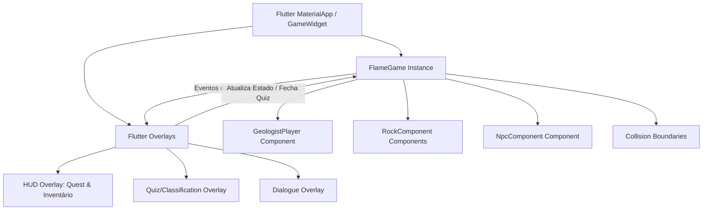

# Rock Cycle Explorer - GDD Revisado & Arquitetura Técnica (MVP 1 Semana)

Este documento foi reestruturado sob a perspectiva de um Tech Lead e Game Designer Sênior para garantir a entrega de um MVP (Mínimo Produto Viável) jogável e divertido dentro do prazo estrito de **1 semana**, utilizando a **Flame Engine** integrada ao **Flutter**.

---

## 1. Análise Crítica e Gestão de Riscos

O escopo inicial assemelhava-se mais a um aplicativo de formulários do que a um jogo. Para transformá-lo em uma experiência lúdica em apenas 1 semana, identificamos os seguintes riscos e alternativas:

| Recurso Original | Fator de Risco | Decisão de Design para o MVP |
| :--- | :--- | :--- |
| **Múltiplos Biomas/Mapas** | Altíssimo (carregamento, level design, assets de tilesets separados). | **Mapa Único Contínuo**: Uma única tela de exploração dividida em 3 zonas visuais (Vulcão, Cânion, Caverna). |
| **Laboratório como outra Tela** | Alto (quebra o fluxo do jogo, exige transição complexa de estados). | **Laboratório de Campo**: A análise ocorre *in-game* via overlay do Flutter assim que a rocha é inspecionada. |
| **Enciclopédia Completa** | Médio (excesso de UI estática desnecessária para testar a diversão). | **Caderno de Campo Simples**: Um painel compacto acessível a partir do HUD do jogo. |
| **Combate ou Movimentos Avançados** | Alto (física complexa, animações difíceis no Flame). | **Movimentação 2D Top-Down Simples**: Controle direcional (WASD/Setas ou Joystick Virtual) e colisão básica (AABB). |

---

## 2. GDD Revisado: O Jogo

### Conceito
Um jogo de exploração 2D top-down onde o jogador controla a geóloga **Dra. Sophia** em uma ilha vulcânica ativa. O objetivo é coletar amostras de rochas direto no campo, classificá-las de acordo com as pistas geológicas e entregá-las para a líder da expedição (**Dra. Terra**) para completar a quest de mapeamento da ilha.

### Loop de Gameplay Simplificado (Flame-First)
1.  **Explorar:** Caminhar pelo mapa usando o teclado ou joystick virtual.
2.  **Identificar:** Encontrar nós de rocha cintilantes espalhados pelas três zonas do mapa.
3.  **Classificar (Desafio):** Interagir com a rocha. Abre-se um pop-up (Overlay Flutter) mostrando pistas visuais/textuais da rocha. O jogador escolhe se é Ígnea, Sedimentar ou Metamórfica.
4.  **Entregar:** Levar as rochas corretas para a Dra. Terra (NPC na base) para concluir a quest e vencer o jogo.

---

## 3. Arquitetura Técnica (Flutter + Flame)

A melhor prática no desenvolvimento com Flame é utilizar o motor para a renderização do mundo do jogo (Canvas, sprites, colisões, física) e o Flutter para a interface do usuário (HUD, diálogos, quizzes de classificação) por meio de **Overlays**.



### Componentes Flame Principais
1.  `RockCycleGame` (extends `FlameGame` com `HasCollisionDetection` e `HasKeyboardHandlerComponents`): A classe central do ciclo de vida do jogo.
2.  `GeologistPlayer` (extends `SpriteAnimationComponent` com `CollisionCallbacks`, `KeyboardHandler`): O jogador, com animação de caminhada em 4 direções e caixa de colisão.
3.  `RockComponent` (extends `SpriteComponent` com `CollisionCallbacks`): Representa os nós de minério no cenário. Possui uma propriedade com o ID da rocha.
4.  `NpcComponent` (extends `SpriteComponent` com `CollisionCallbacks`): A Dra. Terra, posicionada perto do ponto inicial.
5.  `ObstacleComponent` (extends `PositionComponent` com `CollisionCallbacks`): Blocos invisíveis para delimitar as paredes do mapa e impedir que o jogador saia dos limites.

### Gerenciamento de Estado
*   Utilizaremos uma classe simples de estado (`GameState`) que estende `ChangeNotifier`.
*   Esta classe será compartilhada entre o Flame e os Overlays Flutter para rastrear:
    *   Inventário de rochas classificadas com sucesso.
    *   Quest ativa e progresso (ex: "Coletou 1/2 rochas ígneas").
    *   Nível/XP de geólogo do jogador.

---

## 4. Estrutura de Pastas Sugerida

A estrutura abaixo separa a lógica do jogo (Flame), os modelos de dados e a interface visual de suporte (Flutter Overlays).

```
lib/
├── main.dart                     # Inicialização do MaterialApp e do GameWidget com overlays
├── game/
│   ├── rock_cycle_game.dart      # Classe principal do Flame Game loop
│   ├── components/
│   │   ├── player.dart           # Componente do Jogador (Dra. Sophia)
│   │   ├── rock.dart             # Componentes das rochas coletáveis
│   │   ├── npc.dart              # Componente da Dra. Terra (NPC de Quests)
│   │   └── obstacle.dart         # Componente de colisão de borda/obstáculos
│   └── helpers/
│       ├── constants.dart        # Configurações de tamanhos, velocidades e cores
│       └── asset_loader.dart     # Gerenciamento de carregamento de sprites/imagens
├── models/
│   ├── rock_model.dart           # Modelo de dados da rocha (pistas, tipo, imagem)
│   ├── quest_model.dart          # Modelo de dados da missão ativa
│   └── game_state.dart           # Estado reativo do jogo (ChangeNotifier)
└── widgets/
    ├── hud_overlay.dart          # Barra de topo com inventário rápido e quests
    ├── dialogue_overlay.dart     # Painel de conversação com NPCs
    ├── quiz_overlay.dart         # Janela de análise e classificação científica
    └── victory_overlay.dart      # Tela de encerramento acadêmico (Badge de Geólogo)
```

---

## 5. Backlog do MVP (1 Semana)

### 🔴 Essencial (Must Have - MVP Jogável)
*   [ ] Configurar projeto com Flutter + Flame + pacotes adicionais.
*   [ ] Criar modelos de dados (`RockModel`, `GameState`).
*   [ ] Implementar jogador com movimentação 4 direções (teclado/virtual joystick) e colisão básica.
*   [ ] Desenhar o mapa contínuo com 3 biomas básicos (usando formas simples/sprites de cores diferentes para separar vulcão, rio e caverna).
*   [ ] Componente de rochas interativas que detectam colisão com o jogador.
*   [ ] Overlay do Flutter para o minijogo de classificação (Quiz) quando o jogador tocar em uma rocha.
*   [ ] NPC de quest básico que verifica se o jogador coletou o que foi pedido e aciona a tela de vitória.
*   [ ] Tela de vitória.

### 🟡 Desejável (Should Have - Polimento para Apresentação)
*   [ ] Sprites animados para o jogador (caminhada).
*   [ ] Efeito de partícula (cintilação) nas rochas que precisam ser coletadas.
*   [ ] Efeitos sonoros básicos de clique, acerto no quiz e conclusão de quest.
*   [ ] Painel de "Caderno de Campo" (Encyclopedia) compacto no HUD para ver detalhes das rochas já classificadas.

### 🟢 Futuro (Nice to Have - Expansão Pós-Apresentação)
*   [ ] Integração com mapas complexos vindos do Tiled (.tmx).
*   [ ] Minijogo físico de quebra de rocha usando física do Flame/Forge2D.
*   [ ] Ciclo de metamorfismo interativo (levar uma rocha sedimentar até a zona de pressão/calor para transformá-la).
*   [ ] Ciclo dia/noite ou efeitos climáticos dinâmicos.

---

## 6. Cronograma Realista de 7 Dias

Este cronograma foi projetado para garantir que você tenha um **protótipo funcional todos os dias** para apresentar ao seu orientador acadêmico.

```
┌────────────────────────────────────────────────────────┐
│             CRONOGRAMA DE 7 DIAS (FLAME + FLUTTER)     │
├───────┬────────────────────────────────────────────────┤
│ Dia 1 │ Setup do Flame, Models e Player na Tela        │
│ Dia 2 │ Movimentação, Colisões e Obstáculos do Mapa    │
│ Dia 3 │ Spawners de Rochas e NPC Interativo            │
│ Dia 4 │ Integração de Overlays (HUD e Balão de Fala)   │
│ Dia 5 │ Minijogo de Classificação (Overlay Quiz)       │
│ Dia 6 │ Sistema de Quests e Vitória (Progresso Completo)│
│ Dia 7 │ Polimento Visual, Testes e Correções Finais    │
└───────┴────────────────────────────────────────────────┘
```

### Detalhamento Diário

*   **Dia 1: Fundação do Game Loop**
    *   *Objetivo:* Instalar o Flame, configurar a `RockCycleGame` classe e desenhar a Dra. Sophia parada na tela.
    *   *Resultado jogável do dia:* Uma janela preta com um sprite/quadrado no centro representando o jogador.
*   **Dia 2: Movimentação e Barreiras**
    *   *Objetivo:* Adicionar a lógica de input de teclado/joystick virtual e colisores invisíveis para delimitar as áreas (vulcão, canyon, montanhas).
    *   *Resultado jogável do dia:* O jogador agora caminha pela tela e é bloqueado pelas bordas.
*   **Dia 3: Povoando o Mundo**
    *   *Objetivo:* Adicionar os componentes de Rocha (`RockComponent`) e a Dra. Terra (`NpcComponent`) no mapa, configurando suas caixas de colisão.
    *   *Resultado jogável do dia:* O jogador pode andar e encostar nas rochas e no NPC, disparando logs no console (`print('Colidiu com Rocha X')`).
*   **Dia 4: HUD e Comunicação (Overlays)**
    *   *Objetivo:* Criar o `hud_overlay.dart` (para mostrar a mochila e quests) e o `dialogue_overlay.dart` (para mostrar o texto da Dra. Terra).
    *   *Resultado jogável do dia:* Ao encostar no NPC, a conversa abre em um balão de diálogo elegante do Flutter.
*   **Dia 5: O Laboratório de Classificação**
    *   *Objetivo:* Desenvolver o `quiz_overlay.dart`. Quando o jogador colidir com uma rocha e pressionar interagir, abre o quiz com as propriedades/dicas e as opções para escolher a categoria.
    *   *Resultado jogável do dia:* Ciclo completo de coleta e resposta. Ao responder corretamente, a rocha some do mapa e vai para o inventário.
*   **Dia 6: O Ciclo Completo (Quests + Vitória)**
    *   *Objetivo:* Integrar o `GameState` com o NPC para que ela reconheça o progresso da missão. Desenvolver o overlay de vitória.
    *   *Resultado jogável do dia:* O jogo agora tem início, meio e fim. O jogador coleta as rochas corretas, entrega ao NPC e vence o jogo.
*   **Dia 7: Polimento e Entrega**
    *   *Objetivo:* Ajustar a paleta de cores das zonas, adicionar efeitos de transição simples, revisar ortografia das dicas didáticas e compilar para web/Linux para entrega acadêmica.
