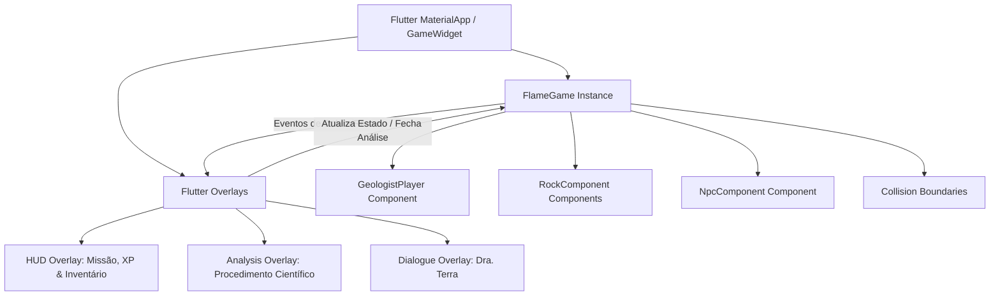

# Rock Cycle Explorer - GDD Revisado & Arquitetura Técnica (MVP 1 Semana)

Este documento reflete a visão oficial do jogo, focada em entregar um MVP jogável e divertido dentro do prazo estrito de **1 semana**, utilizando a **Flame Engine** integrada ao **Flutter**. O foco é criar um RPG leve de exploração geológica.

---

## 1. Visão Geral e Premissa

Uma ilha apresenta formações geológicas incomuns. Uma expedição científica é enviada para investigar. O jogador controla a geóloga **Dra. Sophia**, enviada a campo para investigar esses fenômenos. O objetivo é coletar evidências, analisar amostras na base e ajudar a compreender os fenômenos da ilha.

**Personagem Principal:** Dra. Sophia (Geóloga de campo).
**NPC Principal:** Dra. Terra (Líder da expedição científica, orienta missões e valida descobertas).

---

## 2. Loop Oficial de Gameplay

O jogo não é um questionário disfarçado. O aprendizado é consequência da progressão em um fluxo científico natural:

1. **Exploração:** Caminhar pelo mapa.
2. **Coleta de Evidências:** Encontrar rochas e coletar amostras no ambiente.
3. **Retorno à Base Científica:** Voltar ao hub principal da expedição.
4. **Análise Científica:** Procedimento de observação de propriedades na base.
5. **Registro da Descoberta:** Adição ao diário/caderno de campo.
6. **XP / Progressão:** Ganho de níveis, títulos e reconhecimento.
7. **Nova Missão:** Receber o próximo objetivo.

---

## 3. Estrutura das Fases

### Fase 1 — Exploração
O jogador explora ambientes contínuos (Vulcão, Cânion, Caverna, Montanha). O objetivo é encontrar rochas e coletar amostras.
*Nota de Design: A análise NÃO ocorre durante a exploração.*

### Fase 2 — Retorno à Base
Após a coleta, o jogador retorna à base científica. A base funciona como o hub principal do jogo, onde ocorre o diálogo com NPCs, a entrega de amostras, o progresso da narrativa e o início da análise científica.

### Fase 3 — Análise Científica
Realizada na base, simulando um procedimento científico (observar cristais, camadas, cor, textura). O jogador utiliza as evidências coletadas para identificar a rocha. A mecânica se assemelha a uma ferramenta analítica do universo do jogo, garantindo a imersão.

### Fase 4 — Registro
Ao identificar corretamente a rocha, ela é registrada no caderno de campo da expedição e XP é concedido.

### Fase 5 — Progressão
O jogador recebe XP, avança de níveis e ganha títulos de reconhecimento científico, reforçando a fantasia de ser um geólogo explorador.

---

## 4. Arquitetura Técnica (Flutter + Flame)

O Flame cuida do mundo do jogo (Canvas, sprites, colisões, física), enquanto o Flutter gerencia a interface do usuário (HUD, diálogos, telas de análise e caderno de campo) usando **Overlays**.



---

## 5. Estrutura de Pastas Sugerida

```
lib/
├── main.dart
├── game/
│   ├── rock_cycle_game.dart
│   ├── components/
│   │   ├── player.dart           # Dra. Sophia
│   │   ├── rock.dart             # Amostras interativas (coleta)
│   │   ├── npc.dart              # Dra. Terra (Base)
│   │   └── obstacle.dart
│   └── helpers/
│       ├── constants.dart
│       └── asset_loader.dart
├── models/
│   ├── rock_model.dart           # Dados da rocha (cristais, camadas, cor)
│   ├── quest_model.dart          # Missão ativa e progresso
│   └── game_state.dart           # XP, nível, inventário
└── widgets/
    ├── hud_overlay.dart          # XP, nível e bússola/mochila
    ├── dialogue_overlay.dart     # Painel de conversação com NPCs
    ├── analysis_overlay.dart     # Ferramenta científica (Base)
    └── field_book_overlay.dart   # Caderno de campo e registros
```

---

## 6. Backlog do MVP (1 Semana)

### 🔴 Essencial (Must Have - MVP Jogável)
*   [ ] Configurar projeto com Flutter + Flame.
*   [ ] Criar modelos de dados (`RockModel`, `GameState` com XP e missões).
*   [ ] Movimentação (teclado/joystick virtual) e colisão básica.
*   [ ] Desenhar mapa contínuo com biomas (Vulcão, Cânion, Caverna, Montanha) e Base.
*   [ ] Componentes de Rochas interativos (apenas coleta para inventário).
*   [ ] NPC Dra. Terra na base para iniciar diálogos e análises.
*   [ ] Overlay de Análise Científica (acionado na base após coleta).
*   [ ] Sistema de Registro (Caderno de Campo) e Progressão (XP).

### 🟡 Desejável (Should Have - Polimento)
*   [ ] Sprites animados para a personagem.
*   [ ] Efeitos sonoros básicos de passos, coleta, e sucesso na análise.
*   [ ] Efeito de partícula ao coletar a amostra.

### 🟢 Futuro (Nice to Have - Expansão Pós-Apresentação)
*   [ ] Integração com mapas Tiled (.tmx).
*   [ ] Ciclo de metamorfismo interativo visual.

---

## 7. Cronograma Realista de 7 Dias

```
┌────────────────────────────────────────────────────────┐
│             CRONOGRAMA DE 7 DIAS (FLAME + FLUTTER)     │
├───────┬────────────────────────────────────────────────┤
│ Dia 1 │ Setup do Flame, Models e Player na Tela        │
│ Dia 2 │ Movimentação, Colisões e Biomas do Mapa        │
│ Dia 3 │ Spawners de Rochas (Coleta) e NPC na Base      │
│ Dia 4 │ Overlays de HUD (XP/Missões) e Diálogo         │
│ Dia 5 │ Sistema de Análise Científica (Overlay na Base)│
│ Dia 6 │ Registro (Caderno) e Progressão de Nível       │
│ Dia 7 │ Polimento Visual, Testes e Correções Finais    │
└───────┴────────────────────────────────────────────────┘
```
